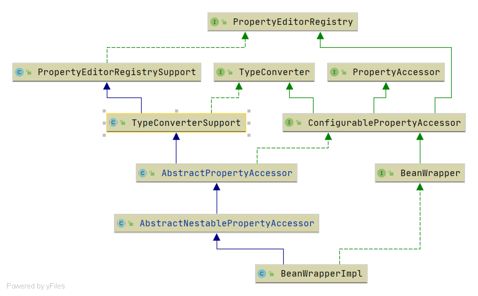

# Spring BeanWrapper 阅读路线

- beanWrapper 的接口和类的体系很简单, 类图不是很复杂. 
    
    
    对于BeanWrapper我们仅需要直接阅读两个类
    1. BeanWrapper 接口: [分析文章](/docs/beans/BeanWrapper/Spring-BeanWrapper.md)
    2. BeanWrapperImpl 实现类: [分析文章](/docs/beans/BeanWrapper/Spring-BeanWrapperImpl.md)
    作为拓展可以了解在 BeanWrapper 上方的接口
    1. ConfigurablePropertyAccessor: [分析文章](/docs/beans/ConfigurablePropertyAccessor/Spring-ConfigurablePropertyAccessor.md)
    2. TypeConverter: [分析文章](/docs/core/convert/Spring-TypeConverter.md)
    3. PropertyEditorRegistry: [分析文章](/docs/beans/propertyEditor/Spring-PropertyEditorRegistry.md)
    4. PropertyAccessor: [分析文章](/docs/beans/PropertyAccessor/Spring-PropertyAccessor.md)