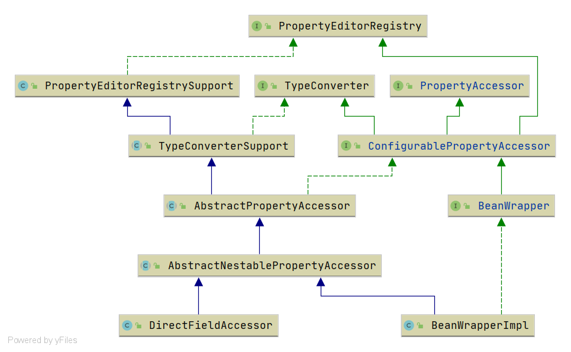

# Spring PropertyAccessor 阅读指南
本节围绕`PropertyAccessor`接口进行展开, 重点介绍接口的作用及其实现类. 下面是`PropertyAccessor`的类图

- 围绕着类图将进行下面这些类的分析
    - [PropertyAccessor](/docs/beans/PropertyAccessor/Spring-PropertyAccessor.md)
        - [ConfigurablePropertyAccessor](/docs/beans/ConfigurablePropertyAccessor/Spring-ConfigurablePropertyAccessor.md)
            - [BeanWrapper](/docs/beans/BeanWrapper/Spring-BeanWrapper.md)
                - [BeanWrapperImpl](/docs/beans/BeanWrapper/Spring-BeanWrapperImpl.md)
            - [AbstractPropertyAccessor](/docs/beans/PropertyAccessor/Spring-AbstractPropertyAccessor.md)
                - [AbstractNestablePropertyAccessor](/docs/beans/AbstractNestablePropertyAccessor/Spring-AbstractNestablePropertyAccessor.md)
                    - DirectFieldAccessor
                    - [BeanWrapperImpl](/docs/beans/BeanWrapper/Spring-BeanWrapperImpl.md)