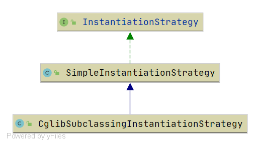

# Spring InstantiationStrategy 阅读路线

本节将介绍 Spring 中 Bean 的实例化策略. 在 Spring 中负责这一功能的接口是: `org.springframework.beans.factory.support.InstantiationStrategy`
    本节回对 `InstantiationStrategy` 做一个分析

围绕类图就开始本节的分析, 相关文章请查看下面内容

- [InstantiationStrategy](/docs/beans/factory/BeanFactory/support/InstantiationStrategy/Spring-InstantiationStrategy.md)
- [Spring-SimpleInstantiationStrategy](/docs/beans/factory/BeanFactory/support/InstantiationStrategy/Spring-SimpleInstantiationStrategy.md)
- [Spring-CglibSubclassingInstantiationStrategy](/docs/beans/factory/BeanFactory/support/InstantiationStrategy/Spring-CglibSubclassingInstantiationStrategy.md)