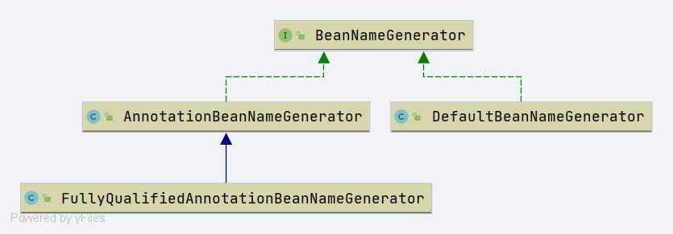

# Spring BeanNameGenerator
- Author: [HuiFer](https://github.com/huifer)
- 源码阅读仓库: [SourceHot-spring](https://github.com/SourceHot/spring-framework-read)


- 类全路径: `org.springframework.beans.factory.support.BeanNameGenerator`
- 方法用来生成 beanName


```java
public interface BeanNameGenerator {

	/**
	 * Generate a bean name for the given bean definition.
	 * 生成 beanName
	 * @param definition the bean definition to generate a name for
	 * @param registry the bean definition registry that the given definition
	 * is supposed to be registered with
	 * @return the generated bean name
	 */
	String generateBeanName(BeanDefinition definition, BeanDefinitionRegistry registry);

}
```





## DefaultBeanNameGenerator

- `org.springframework.beans.factory.support.DefaultBeanNameGenerator`


- 调用工具类方法进行生成

```JAVA
@Override
public String generateBeanName(BeanDefinition definition, BeanDefinitionRegistry registry) {
   return BeanDefinitionReaderUtils.generateBeanName(definition, registry);
}
```


1. ClassName + # + 十六进制字符
2. parentName + $child + # + 十六进制字符
3. factoryBeanName +$created+# + 十六进制字符
4. beanName + # + 序号

```java
public static String generateBeanName(
      BeanDefinition definition, BeanDefinitionRegistry registry, boolean isInnerBean)
      throws BeanDefinitionStoreException {

   // 获取 bean class 的名称
   // Class.getName()
   String generatedBeanName = definition.getBeanClassName();
   if (generatedBeanName == null) {
      // 父类名称是否存在
      if (definition.getParentName() != null) {
         generatedBeanName = definition.getParentName() + "$child";
      }
      // 工厂 beanName 是否为空
      else if (definition.getFactoryBeanName() != null) {
         generatedBeanName = definition.getFactoryBeanName() + "$created";
      }
   }
   if (!StringUtils.hasText(generatedBeanName)) {
      throw new BeanDefinitionStoreException("Unnamed bean definition specifies neither " +
            "'class' nor 'parent' nor 'factory-bean' - can't generate bean name");
   }

   String id = generatedBeanName;
   if (isInnerBean) {
      // Inner bean: generate identity hashcode suffix.
      // 组装名称
      // 生成名称 + # + 16 进制的一个字符串
      id = generatedBeanName + GENERATED_BEAN_NAME_SEPARATOR + ObjectUtils.getIdentityHexString(definition);
   }
   else {
      // Top-level bean: use plain class name with unique suffix if necessary.
      // 唯一beanName设置
      // // beanName + # + 序号
      return uniqueBeanName(generatedBeanName, registry);
   }
   return id;
}
```


## AnnotationBeanNameGenerator

1. 获取注解的value作为beanName
2. 类名首字母小写

```java
@Override
public String generateBeanName(BeanDefinition definition, BeanDefinitionRegistry registry) {
   if (definition instanceof AnnotatedBeanDefinition) {
      // 从注解中获取 beanName
      // 获取注解的value属性值
      String beanName = determineBeanNameFromAnnotation((AnnotatedBeanDefinition) definition);
      if (StringUtils.hasText(beanName)) {
         // Explicit bean name found.
         // 如果存在直接返回
         return beanName;
      }
   }
   // Fallback: generate a unique default bean name.
   // 默认beanName
   // 类名,首字母小写
   return buildDefaultBeanName(definition, registry);
}
```


## FullyQualifiedAnnotationBeanNameGenerator

- 全类名

```java
@Override
protected String buildDefaultBeanName(BeanDefinition definition) {
   String beanClassName = definition.getBeanClassName();
   Assert.state(beanClassName != null, "No bean class name set");
   return beanClassName;
}
```