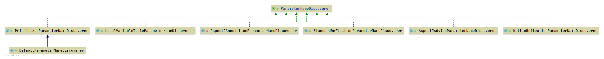

# Spring ParameterNameDiscoverer 阅读路线
本节将介绍 Spring 中参数名称发现器的作用. 
 在 Spring 中 `ParameterNameDiscoverer` 提供了两个获取参数名称的方法。
    1. 获取 Method 对象的参数名称
    2. 获取 Constructor 对象的参数名称
    
    
类图: 

详细分析请查看下面这些文章

- **[StandardReflectionParameterNameDiscoverer](/docs/core/ParameterNameDiscoverer/Spring-StandardReflectionParameterNameDiscoverer.md)**
- [AspectJAdviceParameterNameDiscoverer](/docs/core/ParameterNameDiscoverer/Spring-AspectJAdviceParameterNameDiscoverer-未完成.md)
- [KotlinReflectionParameterNameDiscoverer](/docs/core/ParameterNameDiscoverer/Spring-KotlinReflectionParameterNameDiscoverer.md)
- [PrioritizedParameterNameDiscoverer](/docs/core/ParameterNameDiscoverer/Spring-PrioritizedParameterNameDiscoverer.md)
    - [DefaultParameterNameDiscoverer](/docs/core/ParameterNameDiscoverer/Spring-DefaultParameterNameDiscoverer.md)
- [AspectJAnnotationParameterNameDiscoverer](/docs/core/ParameterNameDiscoverer/Spring-AspectJAnnotationParameterNameDiscoverer.md)
- [LocalVariableTableParameterNameDiscoverer](/docs/core/ParameterNameDiscoverer/Spring-LocalVariableTableParameterNameDiscoverer.md)